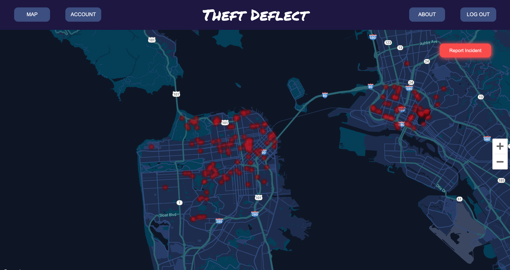
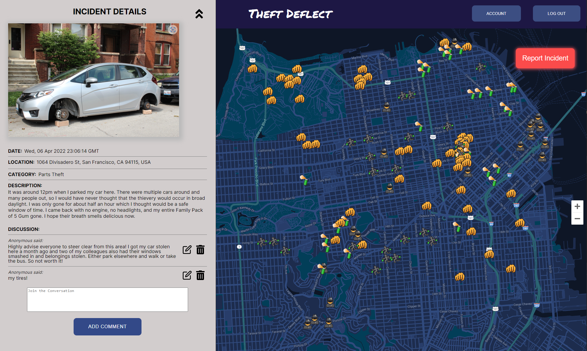

# TheftDeflect
[Live Demo](https://theftdeflect.herokuapp.com)

## Background
TheftDeflect is created by four developers - Disnee Tamang, Justin Nguyen, Kenneth Quach, and Phillip Lai. 
It was envisioned as an app to help address the Bay Area's notoriously prevalent vehicle related crime occurrences. 
More often than not, parking a vehicle overnight (occasionally even in daylight hours) in a non-residential area will result in some form of vandalism occuring, whether it be parts robbery, or window break-in. 
TheftDeflect helps community members quickly and efficiently report instances of vehicle crime by allowing users to make public reports of incidents with specific locations tagged, 
as well as view areas of high crime probability using the heat map layer.

## Functionality
TheftDeflect renders a "heat-map" view by converting marked pins into bright red, hazy spots that conglomerate into "heat" zones with varying degrees of size and opacity depending on the frequency of pins in the area. 
Users can view individual reports, depicted as dropped pins on the map, by zooming in twice to a chosen area. The map responds by switching to pin view, and users can now click on any marker to view incident details. 
The details are shown on a left drop-down bar containing an image/description of the crime, as well as the ability to add/edit/delete discussion comments. If the current logged in user is the creator of the pin, they have the ability to edit/remove the report. 

Reports can be made by users by clicking on the "Report Incident" button on the top right of the screen. Doing so will instruct the user to click wherever on the map the crime occurred, pulling up an report form modal when done so. 
Once the user has entered the form's details and pressed submit, the pin will be immediately available for view on the map.

## Technologies Implemented
* MongoDB
* Express.js
* React/Redux
* Node.js
* Google Maps API
* AWS S3

## Future Additions
* Mobile-friendly across all platforms
* Expansion into different cities outside of the Bay Area
